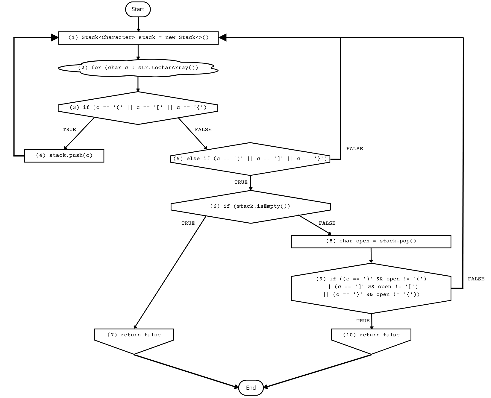
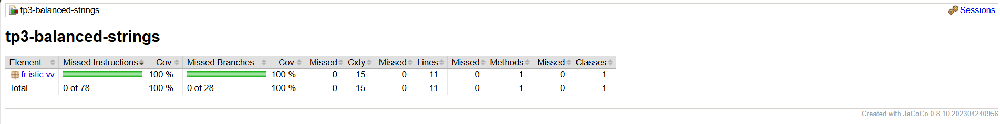
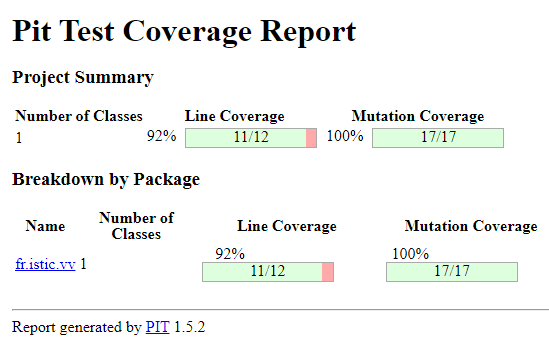

# Balanced strings

A string containing grouping symbols `{}[]()` is said to be balanced if every open symbol `{[(` has a matching closed symbol `)]}` and the substrings before, after and between each pair of symbols is also balanced. The empty string is considered as balanced.

For example: `{[][]}({})` is balanced, while `][`, `([)]`, `{`, `{(}{}` are not.

Implement the following method:

```java
public static boolean isBalanced(String str) {
    ...
}
```

`isBalanced` returns `true` if `str` is balanced according to the rules explained above. Otherwise, it returns `false`.

Use the coverage criteria studied in classes as follows:

1. Use input space partitioning to design an initial set of inputs. Explain below the characteristics and partition blocks you identified.
2. Evaluate the statement coverage of the test cases designed in the previous step. If needed, add new test cases to increase the coverage. Describe below what you did in this step.
3. If you have in your code any predicate that uses more than two boolean operators, check if the test cases written so far satisfy *Base Choice Coverage*. If needed, add new test cases. Describe below how you evaluated the logic coverage and the new test cases you added.
4. Use PIT to evaluate the test suite you have so far. Describe below the mutation score and the live mutants. Add new test cases or refactor the existing ones to achieve a high mutation score.

Write below the actions you took on each step and the results you obtained.
Use the project in [tp3-balanced-strings](../code/tp3-balanced-strings) to complete this exercise.

## Answer

### Implementation of the method

You can find in the ``code/tp3-balanced-strings/src/main/java/fr/istic/vv/StringUtils.java`` file the implementation of the method. To do it, we used a LIFO (Last In First Out) Structure as suggested in this [website](https://www.enjoyalgorithms.com/blog/check-for-balanced-parentheses-in-expression).

Here is the control flow graph of our method to get an idea of its structure :



### 1. Input Space Partionning to design an Initial set of inputs

When we refer to the [Textbook written by Oscar Luis Vera-Pérez](https://oscarlvp.github.io/vandv-classes/#_input_space_partitioning), we understand that Input space partitioning is a technique that divides the input domain into partitions based on specific characteristics to ensure that test inputs represent a wide range of possible values, including valid and invalid inputs.

In our case the key characteristics of the input domain could be :
- the length of the string (short : less than 3, normal : between 4 and 10, long : mre than 10)
- the type of grouping symbols (one, two or three types of symbols in the same expression)
- the correctness of the grouping (only opening or closing strings, not balanced strings...)
- the presence of non grouping characters (only grouping symbols, only non grouping symbols)

We can define the partition blocks in a table. (true if the expression is balanced, false otherwise)

| Caracteristics | String Length| Types of Grouping Symbols| Correctness of the grouping| Non grouping characters                              |
| -------- | ----------------------------------------------------------------- | --------------------------------------------------- | ----------------------------------------------- | ---------------------------------------------------------------- |
| Block 1  | *Short* :<br>`` `` : True<br>``(``: False<br>``{}`` : True<br>``[)]``: False| *One* :<br>``{}``: True<br>``()``: True<br>``[[]``: False<br>``{}{``: False              | *Only opening* :<br>``(``: False<br>``({``: False<br>``({[``: False<br>``({([``: False | *Just them* :<br>``abc`` : True<br>``123``: True<br>``1a2b`` : True<br>``a4-5y`` : True                |
| Block 2  | *Normal* :<br>``(())`` : True<br>``{[()]}`` : True <br>``[({}]``: False<br>``{[[]}``: False                         | *Two* :<br>``()[]`` : True<br>``({})`` : True<br>``[{]}``: False<br>``([)``: False         | *Only closing* :<br>``)``: False<br>``)}``: False<br>``)}]``: False<br>``)})]``: False | *Not only just them* :<br>``(a)bc`` : True<br>``a{bc}`` : True<br>``(a(bc``: False<br>``a{b]c}``: False |
| Block 3  | *Long* :<br>``((()))()[]`` : True<br>``{[()()]}`` : True<br>``{[()(})]}``: False<br>``{[[()()]}``: False | *Three* :<br>``()[]{}`` : True<br>``[{()}]`` : True<br>``([})``: False<br>``{[(])``: False |                                                 |                                                                  |

### 2. Statement Coverage

To evaluate the statement coverage of the test cases we designed in the previous step, we decided to use Jacoco.

To do it, we added in the pom.xml file of the project related to the balanced string these lines of codes in the plugin section.

``` xml
<!-- JaCoCo plugin for code coverage -->
<plugin>
    <groupId>org.jacoco</groupId>
    <artifactId>jacoco-maven-plugin</artifactId>
    <version>0.8.10</version> <!-- Updated version -->
    <executions>
        <!-- Prepare JaCoCo agent for coverage data collection -->
        <execution>
            <goals>
                <goal>prepare-agent</goal>
            </goals>
        </execution>
        <!-- Generate code coverage report -->
        <execution>
            <id>report</id>
            <phase>test</phase>
            <goals>
                <goal>report</goal>
            </goals>
        </execution>
    </executions>
</plugin>
```

After it, by executing the command ```mvn clean test``` in the project, we obtained this html file in the target/site/jacoco/index.html file that we opened on a browser.



Thanks to this report, we can see that we do not need to add new test cases to increase coverage. In fact, it shows that we have achieved 100% instruction coverage, 100% branch coverage, and 100% coverage of all methods and classes in the package. This indicates that all parts of the code have been executed during testing and there are no missed lines or branches.

### 3. Verification of the _Base Choice Coverage_

In our code, we have a predicate that uses more than two boolean operators. It is this predicate :

``` java
if ((c == ')' && open != '(') || (c == ']' && open != '[') || (c == '}' && open != '{')) {
    return false;
}
```

As mentionned in the [Textbook written by Oscar Luis Vera-Pérez](https://oscarlvp.github.io/vandv-classes/#_input_space_partitioning), to achieve Base Choice Coverage for the boolean expression, we need to ensure that all possible outcomes (true and false) for each component of the boolean expression are covered by the test cases. All the possible outcomes at this step of the code are : 

```
Outcome 1:  c  = ')' AND open  = '(' 
Outcome 2:  c  = ')' AND open != '('  
Outcome 3:  c  = ']' AND open  = '['   
Outcome 4:  c  = ']' AND open != '['  
Outcome 5:  c  = '}' AND open  = '{'  
Outcome 6:  c  = '}' AND open != '{'` 
```

When we look at our current test cases and we number it, here is what we observe :

``` java
package fr.istic.vv;

import org.junit.jupiter.api.DisplayName;
import org.junit.jupiter.api.Test;

import static fr.istic.vv.StringUtils.isBalanced;
import static org.junit.jupiter.api.Assertions.assertFalse;
import static org.junit.jupiter.api.Assertions.assertTrue;

class StringUtilsTest {
    /*      String Length     */

    @DisplayName("String Length : Short")
    @Test
    void isBalancedBlock1Length() {
        assertTrue(isBalanced("")); // None of them
        assertFalse(isBalanced("(")); // None of them
        assertTrue(isBalanced("{}")); // Outcome 5
        assertFalse(isBalanced("[)]"); // Outcome 3 -> 2
    }

    @DisplayName("String Length : Normal")
    @Test
    void isBalancedBlock2Length() {
        assertTrue(isBalanced("(())")); // Outcome 1 -> 1
        assertTrue(isBalanced("{[()]}")); // Outcome 1 -> 3 -> 5
        assertFalse(isBalanced("[({}]"); // Outcome 5 -> 2
        assertFalse(isBalanced("{[[]}")); // Outcome 3 -> 6
    }

    @DisplayName("String Length : Long")
    @Test
    void isBalancedBlock3Length() {
        assertTrue(isBalanced("((()))()[]")); // Outcome 1 -> 1 -> 1 -> 1 -> 3 
        assertTrue(isBalanced("{[()()]}")); // Outcome 1 -> 1 -> 3 -> 5
        assertFalse(isBalanced("{[()(})]}"); // Outcome 1 -> 6
        assertFalse(isBalanced("{[[()()]}"); // Outcome 1 -> 1 -> 3 -> 6
    }

    /*      Types of Grouping Symbols       */

    @DisplayName("Types of Grouping Symbols : 1")
    @Test
    void isBalancedBlock1Types() {
        assertTrue(isBalanced("{}")); // Outcome 5
        assertTrue(isBalanced("()")); // Outcome 1
        assertFalse(isBalanced("[[]"); // Outcome 4
        assertFalse(isBalanced("{}{"); // Outcome 4
    }

    @DisplayName("Types of Grouping Symbols : 2")
    @Test
    void isBalancedBlock2Types() {
        assertTrue(isBalanced("()[]")); // Outcome 1 -> 3
        assertTrue(isBalanced("({})")); // Outcome 5 -> 1
        assertFalse(isBalanced("[{]}"); // Outcome 6
        assertFalse(isBalanced("([)"); // Outcome 2
    }

    @DisplayName("Types of Grouping Symbols : 3")
    @Test
    void isBalancedBlock3Types() {
        assertTrue(isBalanced("()[]{}")); // Outcome 1 -> 3 -> 5
        assertTrue(isBalanced("[{()}]")); // Outcome 1 -> 5 -> 3
        assertFalse(isBalanced("([})"); // Outcome 2
        assertFalse(isBalanced("{[(])"); // Outcome 4
    }

    /*      Correctness of the grouping       */

    @DisplayName("Correctness of the grouping : Only opening")
    @Test
    void isBalancedBlock1Correctness() {
        assertFalse(isBalanced("(")); // None of them
        assertFalse(isBalanced("({")); // None of them
        assertFalse(isBalanced("({[")); // None of them
        assertFalse(isBalanced("({([")); // None of them
    }

    @DisplayName("Correctness of the grouping : Only closing")
    @Test
    void isBalancedBlock2Correctness() {
        assertFalse(isBalanced(")")); // None of them
        assertFalse(isBalanced(")}")); // None of them
        assertFalse(isBalanced(")}]")); // None of them
        assertFalse(isBalanced(")})]")); // None of them
    }

    /*      Non grouping characters       */

    @DisplayName("Non grouping characters : Just them")
    @Test
    void isBalancedBlock1Characters() {
        assertTrue(isBalanced("abc")); // None of them
        assertTrue(isBalanced("123")); // None of them
        assertTrue(isBalanced("1a2b")); // None of them
        assertTrue(isBalanced("a4-5y")); // None of them
    }

    @DisplayName("Non grouping characters : Not only just them")
    @Test
    void isBalancedBlock2Characters() {
        assertTrue(isBalanced("(a)bc")); // Outcome 1
        assertTrue(isBalanced("a{bc}")); // Outcome 5
        assertFalse(isBalanced("(a(bc")); // None of them
        assertFalse(isBalanced("a{b]c}")); // Outcome 4
    }
}
```

With this analysis, we can observe that all outcomes are encontered at least one time. So, we satisfy the Base Choice Coverage. We do not need to add new test cases.

### 4. Verifaction of our test suite with PiTest

By using PIT to evaluate our test suite, we obtain the following result:



The results speak for themselves. The test suite is solid. As we can see, all the mutants were killed during the tests. The only problem we can find is that we have one line not covered out of twelve. So we can consider that we do not need to add new test cases or refactor the existing ones to achieve a higher mutation score.