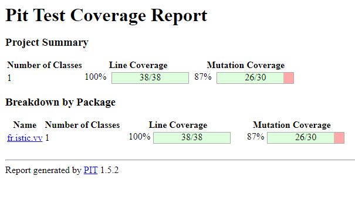

# Balanced strings

A string containing grouping symbols `{}[]()` is said to be balanced if every open symbol `{[(` has a matching closed symbol `)]}` and the substrings before, after and between each pair of symbols is also balanced. The empty string is considered as balanced.

For example: `{[][]}({})` is balanced, while `][`, `([)]`, `{`, `{(}{}` are not.

Implement the following method:

```java
public static boolean isBalanced(String str) {
    ...
}
```

`isBalanced` returns `true` if `str` is balanced according to the rules explained above. Otherwise, it returns `false`.

Use the coverage criteria studied in classes as follows:

1. Use input space partitioning to design an initial set of inputs. Explain below the characteristics and partition blocks you identified.
2. Evaluate the statement coverage of the test cases designed in the previous step. If needed, add new test cases to increase the coverage. Describe below what you did in this step.
3. If you have in your code any predicate that uses more than two boolean operators, check if the test cases written so far satisfy *Base Choice Coverage*. If needed, add new test cases. Describe below how you evaluated the logic coverage and the new test cases you added.
4. Use PIT to evaluate the test suite you have so far. Describe below the mutation score and the live mutants. Add new test cases or refactor the existing ones to achieve a high mutation score.

Write below the actions you took on each step and the results you obtained.
Use the project in [tp3-balanced-strings](../code/tp3-balanced-strings) to complete this exercise.

## Answer

### Implementation of the method

You can find in the ``code/tp3-balanced-strings/src/main/java/fr/istic/vv/StringUtils.java`` file the implementation of the method. To do it, we used a LIFO (Last In First Out) Structure as suggested in this [website](https://www.enjoyalgorithms.com/blog/check-for-balanced-parentheses-in-expression).

### 1. Input Space Partionning to design an Initial set of inputs

When we refer to the [Textbook written by Oscar Luis Vera-Pérez](https://oscarlvp.github.io/vandv-classes/#_input_space_partitioning), we understand that Input space partitioning is a technique that divides the input domain into partitions based on specific characteristics to ensure that test inputs represent a wide range of possible values, including valid and invalid inputs.

In our case the key characteristics of the input domain could be :
- the length of the string (short : less than 3, normal : between 4 and 10, long : mre than 10)
- the type of grouping symbols (one, two or three types of symbols in the same expression)
- the correctness of the grouping (only opening or closing strings, not balanced strings...)
- the presence of non grouping characters (only grouping symbols, only non grouping symbols)

We can define the partition blocks in a table. (true if the expression is balanced, false otherwise)

| Caracteristics | String Length| Types of Grouping Symbols| Correctness of the grouping| Non grouping characters                              |
| -------- | ----------------------------------------------------------------- | --------------------------------------------------- | ----------------------------------------------- | ---------------------------------------------------------------- |
| Block 1  | Short :<br>`` `` : True<br>``(``: False<br>``{}`` : True<br>``[)]``: False| One :<br>``{}``: True<br>``()``: True<br>``[[]``: False<br>``{}{``: False              | Only opening :<br>``(``: False<br>``({``: False<br>``({[``: False<br>``({([``: False | Just them :<br>``abc`` : True<br>``123``: True<br>``1a2b`` : True<br>``a4-5y`` : True                |
| Block 2  | Normal :<br>``(())`` : True<br>``{[()]}`` : True <br>``[({}]``: False<br>``{[[]}``: False                         | Two :<br>``()[]`` : True<br>``({})`` : True<br>``[{]}``: False<br>``([)``: False         | Only closing :<br>``)``: False<br>``)}``: False<br>``)}]``: False<br>``)})]``: False | Not only just them :<br>``(a)bc`` : True<br>``a{bc}`` : True<br>``(a(bc``: False<br>``a{b]c}``: False |
| Block 3  | Long :<br>``((()))()[]`` : True<br>``{[()()]}`` : True<br>``{[()(})]}``: False<br>``{[[()()]}``: False | Three :<br>``()[]{}`` : True<br>``[{()}]`` : True<br>``([})``: False<br>``{[(])``: False |                                                 |                                                                  |


### 2.

### 3.

### 4. Verifaction of our test suite with PiTest



The results speak for themselves. The test suite is solid. As we can see, all the mutants were killed during the tests. The only problem we can find is that we have one line not covered out of twelve.