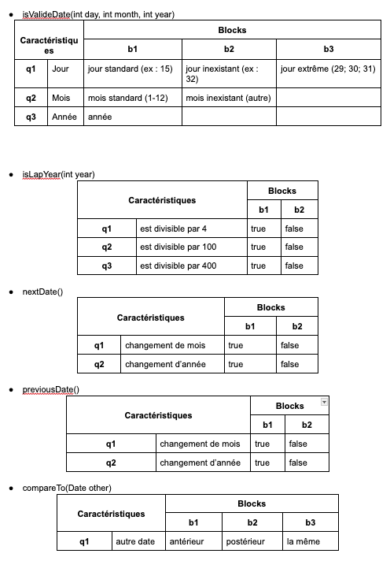

# Test the Date class

Implement a class `Date` with the interface shown below:

```java
class Date implements Comparable<Date> {

    public Date(int day, int month, int year) { ... }

    public static boolean isValidDate(int day, int month, int year) { ... }

    public static boolean isLeapYear(int year) { ... }

    public Date nextDate() { ... }

    public Date previousDate { ... }

    public int compareTo(Date other) { ... }

}
```

The constructor throws an exception if the three given integers do not form a valid date.

`isValidDate` returns `true` if the three integers form a valid year, otherwise `false`.

`isLeapYear` says if the given integer is a leap year.

`nextDate` returns a new `Date` instance representing the date of the following day.

`previousDate` returns a new `Date` instance representing the date of the previous day.

`compareTo` follows the `Comparable` convention:

* `date.compareTo(other)` returns a positive integer if `date` is posterior to `other`
* `date.compareTo(other)` returns a negative integer if `date` is anterior to `other`
* `date.compareTo(other)` returns `0` if `date` and `other` represent the same date.
* the method throws a `NullPointerException` if `other` is `null` 

Design and implement a test suite for this `Date` class.
You may use the test cases discussed in classes as a starting point. 
Also, feel free to add any extra method you may need to the `Date` class.


Use the following steps to design the test suite:

1. With the help of *Input Space Partitioning* design a set of initial test inputs for each method. Write below the characteristics and blocks you identified for each method. Specify which characteristics are common to more than one method.
2. Evaluate the statement coverage of the test cases designed in the previous step. If needed, add new test cases to increase the coverage. Describe below what you did in this step.
3. If you have in your code any predicate that uses more than two boolean operators check if the test cases written to far satisfy *Base Choice Coverage*. If needed add new test cases. Describe below how you evaluated the logic coverage and the new test cases you added.
4. Use PIT to evaluate the test suite you have so far. Describe below the mutation score and the live mutants. Add new test cases or refactor the existing ones to achieve a high mutation score.

Use the project in [tp3-date](../code/tp3-date) to complete this exercise.

## Answer

Pour commencer voici notre implémentation de la classe Date : 
'''java
package fr.istic.vv;

public class Date implements Comparable<Date> {

    private int day;
    private int month;
    private int year;

    public Date(int day, int month, int year) {
        if (!isValidDate(day, month, year)) {
            throw new IllegalArgumentException("Invalid date");
        }
        this.day = day;
        this.month = month;
        this.year = year;
    }

    public static boolean isValidDate(int day, int month, int year) {
        if(year < 1 || month < 1 || month > 12 || day < 1 || day > 31){
            return false;
        }
        
        if(month == 2){
            return day <= (isLeapYear(year) ? 29 : 28);
        }
        
        if(month == 4 || month == 6 || month == 9 || month == 11){
            return day <= 30;
        }
        
        return true;
    }

    public static boolean isLeapYear(int year) {
        return (year % 4 == 0) && ((year % 100 != 0) || (year % 400 == 0));
    }

    public Date nextDate() {
        int d = this.day, m = this.month, y = this.year;
        d++;

        if (!isValidDate(d, m, y)) {
            d = 1;
            m++;
            if (m > 12) {
                m = 1;
                y++;
            }
        }

        return new Date(d, m, y);
    }

    public Date previousDate() {
        int d = this.day, m = this.month, y = this.year;
        d--;

        if (d < 1) {
            m--;
            if (m < 1) {
                m = 12;
                y--;
                d = 31;
            } else {
                d = m == 2 ? (isLeapYear(y) ? 29 : 28) : 31;
            }
        }

        while (!isValidDate(d, m, y)) {
            d--;
        }

        return new Date(d, m, y);
    }

    public int compareTo(Date other) {
        if (other == null) throw new NullPointerException();

        if (this.year != other.year) 
            return this.year - other.year;
        if (this.month != other.month) 
            return this.month - other.month;
        return this.day - other.day;
    }
}
'''


Voici les tableaux que l'on obtient pour chacune des méthodes à l'aide du Input Space Partitioning : 


À partir de là nous établissons une série de tests, que voici dans notre fichier DateTest.java :

'''java
import static org.junit.jupiter.api.Assertions.*;
import org.junit.jupiter.api.Test;

class DateTest {

    //isValideDate
    @Test
    void isValidDate_ValidDate_ReturnsTrue() {
        assertTrue(Date.isValidDate(15, 6, 2021));
    }

    @Test
    void isValidDate_DayInvalid_ReturnsFalse() {
        assertFalse(Date.isValidDate(31, 4, 2021));
    }

    @Test
    void isValidDate_Feb29LeapYear_ReturnsTrue() {
        assertTrue(Date.isValidDate(29, 2, 2024));
    }

    @Test
    void isValidDate_Feb29NonLeapYear_ReturnsFalse() {
        assertFalse(Date.isValidDate(29, 2, 2023));
    }

    //isLeapYear
    @Test
    void isLeapYear_LeapYear_ReturnsTrue() {
        assertTrue(Date.isLeapYear(2024));
    }

    @Test
    void isLeapYear_NonLeapYear_ReturnsFalse() {
        assertFalse(Date.isLeapYear(2023));
    }

    @Test
    void isLeapYear_CenturyLeapYear_ReturnsTrue() {
        assertTrue(Date.isLeapYear(2000));
    }

    @Test
    void isLeapYear_CenturyNonLeapYear_ReturnsFalse() {
        assertFalse(Date.isLeapYear(1900));
    }
    
    //nextDate et previousDate
    @Test
    void nextDate_NormalDay_ReturnsNextDay() {
        Date date = new Date(15, 6, 2021);
        Date nextDate = date.nextDate();
        assertEquals(new Date(16, 6, 2021), nextDate);
    }

    @Test
    void previousDate_NormalDay_ReturnsPreviousDay() {
        Date date = new Date(16, 6, 2021);
        Date previousDate = date.previousDate();
        assertEquals(new Date(15, 6, 2021), previousDate);
    }

    //compareTo
    @Test
    void compareTo_EarlierDate_ReturnsNegative() {
        Date date1 = new Date(15, 6, 2021);
        Date date2 = new Date(16, 6, 2021);
        assertTrue(date1.compareTo(date2) < 0);
    }

    @Test
    void compareTo_LaterDate_ReturnsPositive() {
        Date date1 = new Date(17, 6, 2021);
        Date date2 = new Date(16, 6, 2021);
        assertTrue(date1.compareTo(date2) > 0);
    }

    @Test
    void compareTo_SameDate_ReturnsZero() {
        Date date1 = new Date(16, 6, 2021);
        Date date2 = new Date(16, 6, 2021);
        assertEquals(0, date1.compareTo(date2));
    }

    @Test
    void compareTo_NullDate_ThrowsNullPointerException() {
        Date date = new Date(16, 6, 2021);
        assertThrows(NullPointerException.class, () -> date.compareTo(null));

}
'''

